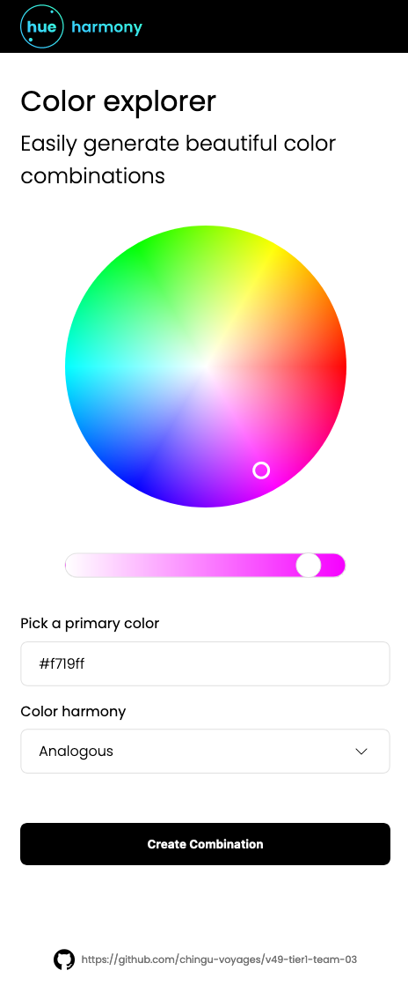
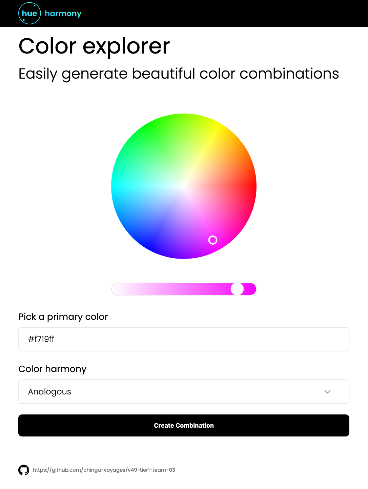
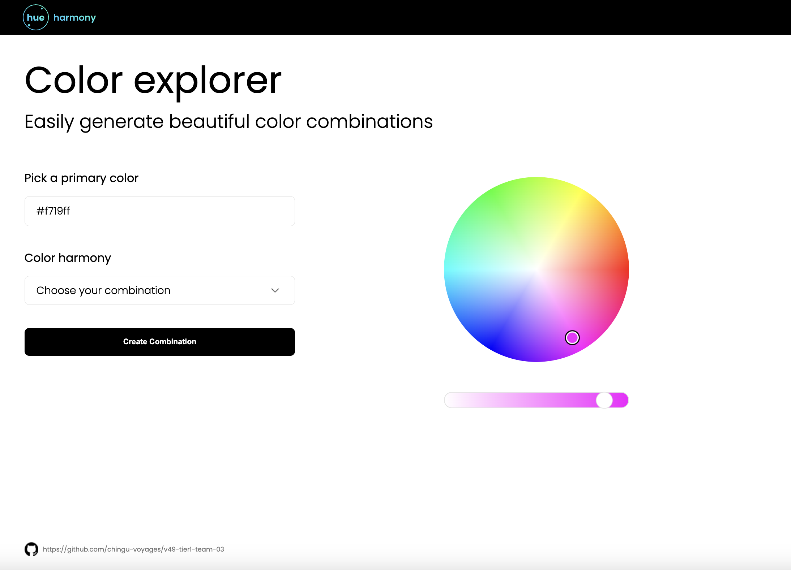

# Hue Harmony

## Overview

Hue harmony is a single page application (SPA) that allows users to get color palette suggestion based on a base color and a color harmony. Hue Harmony leverages the power of AI to provide color palette suggestion for the user.

## Built With

- HTML
- CSS
- Javascript
- [iro.js library](https://iro.js.org)
- Groq AI API using llama3-70b-8192 model
- Figma

### Design

This webpage is responsive and was built based on a "mobile-first" approach. A mobile-first approach is a way to build an app or website by starting with mobile phones and then adding media queries for larger screens, such as tablets and desktops.
Media queries allows you to add styles depending on the device type.
The mobile-first approach is a personal choice for developers because some prefer to start with the desktop and then add media queries for smaller screens.
We decided to use the mobile-first approach because, for mobile, all the items are already stacked one on top of the other, and you just need to add space using margin and padding.

**Mobile view**

**Tablet view**

**Desktop view**

### Features

_Color Selection_: User can select their base color either via the color wheel picker or input the color hexcode into the input field.

_Color Harmony Selection_: User can then select their color harmony of choice via the drop down menu.

_Color Palette Output_: After the selection is made, Hue Harmony will display color suggestion onto a color palette when user clicks on "Create Combination" button.
